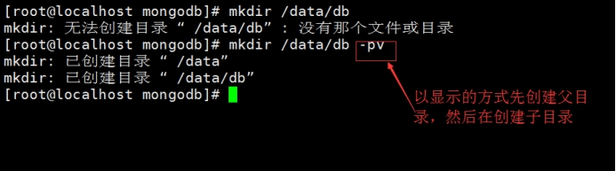
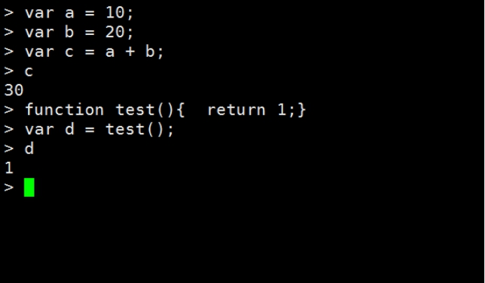
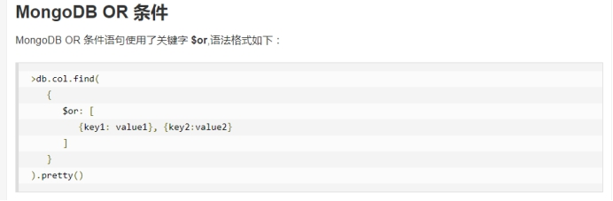
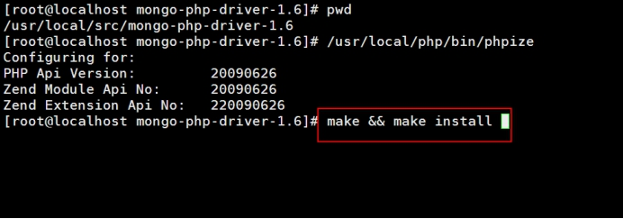
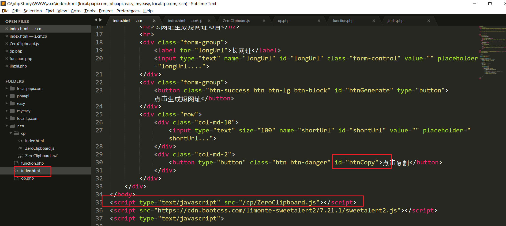
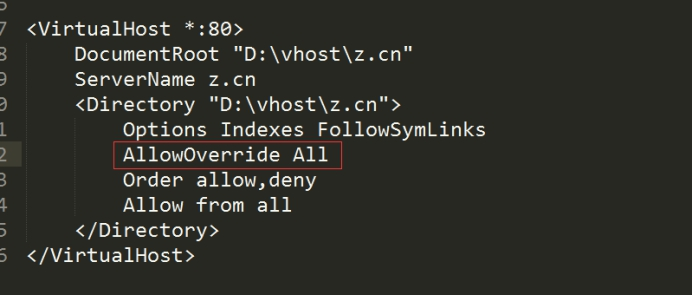
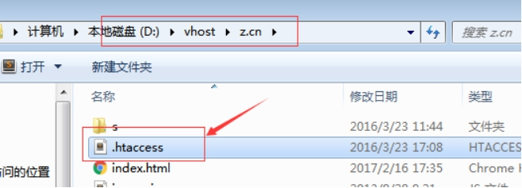
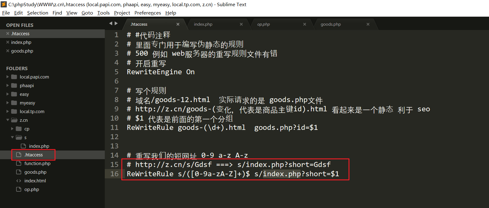

# mongoDB

**mongodb**，也叫作文档型的数据库，一般来说对于我们PHP，这个数据库的使用量还是偏少一点，一般来说我们使用的更多的是memcache和Redis。mongodb一般还是配合前端的javascript工程师和nodejs工程师进行开发使用，一般都将这个数据库做数据存储的仓库。我们PHP后端一般还是习惯用mysql作为数据存储的仓库，一般来说我们PHP程序员习惯使用mongodb存储一些日志信息，例如我们的网站里面做发送短信的业务，用来记录发送了哪些短信。

 

## **简介**

**mongoDB**  被称为文档型数据库，当然也叫Nosql数据库。

**Nosql数据库：**

1.  没有表的概念，没有行和列的概念，即没有二维表

2. 没有sql查询，一般都是自己有相关的查询api，例如mongodb就是使用的javascript的api进行数据的处理，所以对于javascript工程师来说，掌握mongodb是很轻松。


**关系型数据库：**

* 由行和列构成的一张二维表被称为实体。实体和实体之间的关系，被称为E_R模型，则就是关系型数据库的理论基础。

| id   | username | password | email                                     | address      | gender | classid |
| ---- | -------- | -------- | ----------------------------------------- | ------------ | ------ | ------- |
| 1    | caoyang  | admin88  | [gogery@173.com](mailto:gogery@173.com)   | shanghaishi  | m      | 3       |
| 2    | andy     | admin88  | [caoyang@173.com](mailto:caoyang@173.com) | guangzhoushi | m      | 4       |

 

其他的表

| classid | class_name | class_markup  | class_address |      |
| ------- | ---------- | ------------- | ------------- | ---- |
| 3       | php23      | PHP最牛的班级 | 312           | .... |
| 4       | java       | Java还可以吧  | 213           | .... |

 

所以，现在的nosql数据库并不适合做关系很复杂的业务，不好去做连表类型的业务。nosql更多就是一个数据的仓库，不适合做连表业务。


**如果我们希望非关系型数据库去处理这种关系型的业务，该如何处理？**

答：通过==增加冗余的信息==来保证数据的完整性。如果使用非关系型数据库到时候会导致数据量非常大。冗余数据的增加带来的弊端就是磁盘要使用更多，好处也是显而易见，查询更加的便捷，一条查询把所有的数据全部搞定，不需要进行连表业务。


注意：由于mongodb的特性（底层使用json格式的数据进行存储，如果我们严格的规定了json的key=>value对，则看起来想一个行和列构成的二维结构），很像一个关系型的数据库（设计字段），所以有的人尝试把它当成关系型数据库进行使用，然后存在了很多的数据，但是它毕竟不是关系型数据库，所以后期如果需要把mongodb转存到关系型数据库里面，发现实际不可行的。一般这时候都是 mysql + mongodb 一起配合，千万不要mongodb使用在前。


**mongodb被为文档型数据库**

可以这样理解：文档型的数据库存储的数据格式就是经过特殊处理的json格式的数据，存储的载体是文档，专业术语叫做Bson。


简单的理解，Bson比原先的json多了一些数据类型，或者说是数据类型的格式更加的规范，严苛，例如存储的浮点数的精度更加的高。

 

**特点：**

mongodb内部使用**js解释引擎**来实现数据的分析  **。现在还是使用的和chrome浏览器相同的引擎，是现在javascript最厉害的引擎，v8引擎 和我们Nodejs内部的js引擎是一样**。

在插入的时候，将数据转换成二进制的Bson来存储；在查询的时候，将数据Bson转换成json对象返回。

 


现在出了v8引擎，还有其他的很多的引擎，trident、xxmonkey。

<https://liulanmi.com/browser>

<http://www.paopaoche.net/soft/77495.html>


**mongodb与传统关系型数据（MySQL）有什么区别？**

| 名称    | 库     | 表                | 行                          | 操作                                     |
| ------- | ------ | ----------------- | --------------------------- | ---------------------------------------- |
| mongodb | 数据库 | collection (集合) | document 文档json格式的数据 | js面向对象  `db.users.find()`            |
| mysql   | 数据库 | 表                | 记录                        | sql操作`select * from user where id > 1` |

 

mysql:

| id   | username | password | email      |
| ---- | -------- | -------- | ---------- |
| 12   | caoyang  | admin88  | a2@sina.cn |
| 13   | caoyang  | admin88  |            |

 

可以使用一个bson来描述上面的信息

```bson
[

    {

        “id”:12,

        “username”:”caoyang”,

        “password”:”admin88”,

        “classInfo”:{

            "id" : 1

            "class_name": "itphp30",

            "start_time" : 1231231

        }	

    }，

    {

        “id”:22,

        “username”:”adny”,

        “password”:”admin88”,

        “email”:”a2@sian.cn”，

        “classInfo”:{

            "id" : 1

            "class_name": "itphp30",

            "start_time" : 1231231

        }

    }

]
```


**扩展：**

什么是**GeoJson**？topjson?

答：GeoJson 翻译过来是 地理信息的json格式数据。和普通的json的格式稍有一定区别。

普通json格式的数据的如下：

```
{

“id”:22,

“username”:”adny”,

“password”:”admin88”,


```

但是GeoJson里面的key-value的key是受到==严格==的限制的，只能使用固定好的key。

 

网站：

<http://echarts.baidu.com/demo.html#map-china-dataRange>

<http://echarts.baidu.com/echarts2/doc/example/map20.html>

 

<http://www.osgeo.cn/info/270ce>

<https://blog.csdn.net/lzhlzz/article/details/41347929>

 

可能做图表。

<http://echarts.baidu.com>

 


## 安装


1. 下载对应的稳定版源代码，并放置到（/usr/local/src目录下）

   官网：[www.mongodb.org](http://www.mongodb.org)

   中文手册：<http://www.runoob.com/mongodb/mongodb-tutorial.html>

   中文社区：<http://www.mongoing.com/>

   阿里云的mongodb的镜像：<https://mirrors.aliyun.com/mongodb/>

 

 


2. 上传、解压文件（/usr/local/src**/**）

 

​	解压安装包

 

​	然后将mongodb源码移动到上级目录下

 

 

3. 为mongodb创建一个==符号链接==

 

 

4. 查看一下bin目录的命令

 

 

5. 我们通过常看README文件或者帮助命令

 

​	查看帮助

 

 

6. 启动服务：

   a. 创建db文件夹，保存mongodb运行时候的数据库信息

 

​	b. 启动服务

 

参数的解释：

`--dbpath`: 表示是数据库保存的目录

`--logpath`: 表示是日志文件log.txt

`--fork`: 表示该服务在后台运行

 

7. 停止，关闭mongodb，使用kill 命令，不要使用pkill。

 

8. 连接服务端，使用mongo客户端进行连接。

 

9. 简单的使用：只需要遵循js语法，基本都可以使用。能使用的只是ECMAScript定义的函数

 

 


# ==mongoDB使用==（重要）


## **入门命令**

学习文档：

<http://www.runoob.com/mongodb/mongodb-create-database.html>


1. `show dbs`  查看所有的数据库

```
> show dbs;
local  0.078GB
php31  0.078GB
test   0.078GB
> 
```


2. `use databaseName`  选库

    MongoDB可以隐式的创建，直接`use databaseNAME `可以创建一个数据库

```
> use php32;
switched to db php32
> 
> 

> use php33;
switched to db php33
> 
```


3. 查看当前数据库下的集合
   * `show tables` 查看当前库下的数据表
   * `show collections `也可以查看

```
> use php33;
switched to db php33
> show tables;

> show collections;
```


## 库操作

### 创建数据库

mongoDB的库是隐式创建，当use 一个不存在的库的时候，然后在该库下创建collection后即可创建数据库。

```
> use php32;
switched to db php32
```

**注意：** 

a. 使用use 选择一个数据库，这个数据库可以不存在，当在这个数据库下创建集合的时候，则对应的数据库创建成功，使用 `show dbs` 进行查看当前系统所有的数据库时，才能显示当前库。

```
> db.createCollection("students");

> show dbs;
local  0.078GB
php31  0.078GB
php32  0.078GB
test   0.078GB
```

 注意：`db.createCollection("students"); ` 中 db表示当前切换的数据库 php32， createCollection表示在当前数据库创建一个集合，集合的名称为 students ，当创建该集合后，则可以使用 `show dbs` 查看系统所有的数据库信息，也可以使用 `show tables` 查看当前数据库下的集合信息。

```
> show tables;
students
system.indexes
> 
```

其中的students 表示我们刚才创建的集合，system.indexes是系统内部维护的集合。


### 创建表

1. 显式创建

```
> db.createCollection("order")
{ "ok" : 1 }
```


2. 隐式创建

```
> db.myClass.insert({"name":"phpLearn", "classInfo": "PHP学习"});
WriteResult({ "nInserted" : 1 })

```

这里的myClass是用户自定义的集合名称，当不存在的集合里在插入数据的时候，隐式的创建该集合


**集合查看** 

* `show tables `查看当前数据库下的表
* `show collections `也可以查看当前数据库下的表

```
> show tables;
myClass
order
students
system.indexes

> show collections;
myClass
order
students
system.indexes
> 
```

show tables 和 show collections 完全等价。


### **删除表**

`db.collectionName.drop() `删除表

```
> db.students.drop();
true
> 
```

这里的students表示的是集合名称，用户可以换成自己要删除的集合名称。


### **删除数据库**

```
> db.dropDatabase();
{ "dropped" : "php32", "ok" : 1 }
> 
```


## 数据操作

### **基本增删改查命令**

1. `find() `查看

```
> use php31;
switched to db php31

> show tables;
stuendts
system.indexes

> db.stuendts.find();
{ "_id" : ObjectId("5b9b1a93aa27e2cddc7d7a2f"), "name" : "LILY" }
{ "_id" : ObjectId("5b9b1ad2aa27e2cddc7d7a31"), "name" : "MY", "age" : 46 }
{ "_id" : ObjectId("5b9b1ad2aa27e2cddc7d7a32"), "name" : "iju", "age" : 45 }
{ "_id" : ObjectId("5b9b23bdaa27e2cddc7d7a34"), "name" : "andy", "age" : 12, "address" : "shenzhenshi", "money" : 300000 }
```

db表示的是当前数据库 php31

students表示当前数据库下的集合，用户可以换成自己的集合名称

find表示查看所有的记录信息

上面的的：`db.stuendts.find(); `类似下面的SQL语句：

> select * from collectionName;


**备注：**可以在find方法后面在使用`pretty()`方法，将取出的数据以一个优雅的格式显示。

```
> db.stuendts.find().pretty();
{ "_id" : ObjectId("5b9b1a93aa27e2cddc7d7a2f"), "name" : "LILY" }
{ "_id" : ObjectId("5b9b1ad2aa27e2cddc7d7a31"), "name" : "MY", "age" : 46 }
{ "_id" : ObjectId("5b9b1ad2aa27e2cddc7d7a32"), "name" : "iju", "age" : 45 }
{
	"_id" : ObjectId("5b9b23bdaa27e2cddc7d7a34"),
	"name" : "andy",
	"age" : 12,
	"address" : "shenzhenshi",
	"money" : 300000
}

```


### **增加数据 insert**

```
> db.collectionName.isnert(document);
```

注意：document可以是一个js对象，表示是单条记录插入; 也可以是一个数组，数组里面的每个元素又是一个js对象，表示是多条记录插入。

例如：

单条记录

```
> db.collectionName.insert({_id:5, age:18, name:’asion’});
```

多条记录

```
> db.collectionName.insert(
	[
		{date:'2014-12-12', study:'mongodb'},
		{_id:9, gender:'male', name:'caoyang'}
	]
)
```


### **删除数据 remove**

一般来说我们做删除的时候，肯定要设置删除的条件。

```
> db.collectionName.remove(查询表达式,  选项);


```

`选项`  是指  {justOne:true/false}, 是否只删一行，默认为false

等同于

>  delete  from tableName where id > 1 limit 1; 

**注意**

1: 查询表达式依然是个json对象

2: 查询表达式匹配的集合，将被删掉

3: 如果不写查询表达式，tables中的所有文档将被删掉

 

例1: 删除students表中 sn属性值为’001’的数据

```
>  db.students.remove({sn:'001'});
```

例2: 删除students表中gender属性为m的文档，只删除1行

```
> db.students.remove({gender:'m'},{justOne:true});
```


### **修改数据 update**

```
# db.collectionName.update(查询表达式, 新值)
```

等同于

> udpate collectionName  set name = ‘asion’ where id = 1;

 

例如: 现在需要将name为asion的文档的用户名改为caoyang

```
# db.news.update({name:'asion'},{name:'caoyang'});
```

结果: 文档中的其他列不见了，改后只有_id和name列数据

注意-->**新值直接替换了旧值，而不是修改，将我们设置的值做了一个全部的替换**

所以，如果是想修改数据的**某列**，可以用**$set**关键字

```
# db.collectionName.update({name:'asion'}, { $set:{name:'caoyang'} })
```

$set：表示当前的操作是一个更新，而不是替换。


### **查询数据 find、 findOne**

find和findOne都是用来做数据查询的，但是find是显示所有的数据，findOne是查询单条数据的。同时在查询的时候，可以指定==查询的条件==和==显示的字段==信息。

```
> db.collection.find(查询表达式, 显示的列);

> db.collections.find(查询表达式, {列1: 0,  列2:0});
```


例1:查询students所有数据

```
> db.stuendts.find()
{ "_id" : ObjectId("5b9b1a93aa27e2cddc7d7a2f"), "name" : "LILY" }
{ "_id" : ObjectId("5b9b1ad2aa27e2cddc7d7a31"), "name" : "MY", "age" : 46 }
{ "_id" : ObjectId("5b9b1ad2aa27e2cddc7d7a32"), "name" : "iju", "age" : 45 }
{ "_id" : ObjectId("5b9b23bdaa27e2cddc7d7a34"), "name" : "andy", "age" : 12, "address" : "shenzhenshi", "money" : 300000 }
> 
```


例2: db.students.find({},{name:1})

{} 表示取出所有

查询所有文档数据，但是只显示name列数据 (_id属性默认总是查出来)

```
> db.stuendts.find({}, {"name":1});
{ "_id" : ObjectId("5b9b1a93aa27e2cddc7d7a2f"), "name" : "LILY" }
{ "_id" : ObjectId("5b9b1ad2aa27e2cddc7d7a31"), "name" : "MY" }
{ "_id" : ObjectId("5b9b1ad2aa27e2cddc7d7a32"), "name" : "iju" }
{ "_id" : ObjectId("5b9b23bdaa27e2cddc7d7a34"), "name" : "andy" }
```


例3: 查看所有文档指定字段。

查询所有文档数据，但是只显示name列信息，且不显示_id列信息

```
> db.stuendts.find({}, {"name":1, "_id": 0});
{ "name" : "LILY" }
{ "name" : "MY" }
{ "name" : "iju" }
{ "name" : "andy" }
```


例4: 查看单条记录信息

查询所有name值为andy的数据，但是只显示name这列信息，并且只获取一条文档。

```
> db.stuendts.findOne({"name": "andy"}, {"name": 1, "_id": 0});
{ "name" : "andy" }

```


在查询的时候，除了 = 是否还存在其他的查询运算符，例如 > >= < ..... 

参考<http://www.runoob.com/mongodb/mongodb-operators.html>

 


# ==Mongodb高级查询技巧-单一条件==

文档：<http://www.runoob.com/mongodb/mongodb-operators.html>

 

一般的业务还是查询比较多，写的相当来说少一些。

 

 

## 大于查询

`# db.collectionName.find({"查询字段的名称" : {操作符 : 查询值} })`

例如：查询用户的年龄大于 20的用户的用户名和年龄信息

```
> db.stuendts.find({"age": {"$gt": 12}}, {"name": 1, "age": 1, "_id":0});
{ "name" : "MY", "age" : 46 }
{ "name" : "iju", "age" : 45 }
```

等同于

> select name, age from students where age > 12;


## 小于查询

```
> db.stuendts.find({"age": {"$lt": 45}});
{ "_id" : ObjectId("5b9b23bdaa27e2cddc7d7a34"), "name" : "andy", "age" : 12, "address" : "shenzhenshi", "money" : 300000 }
```

等同于

> select * from students where age < 45;


## 小于等于查询

```
> db.stuendts.find({"age": {"$lte": 45}});

{ "_id" : ObjectId("5b9b1ad2aa27e2cddc7d7a32"), "name" : "iju", "age" : 45 }
{ "_id" : ObjectId("5b9b23bdaa27e2cddc7d7a34"), "name" : "andy", "age" : 12, "address" : "shenzhenshi", "money" : 300000 }
```

等同于

> select * from students where age <= 45;


# ==Mongodb高级查询技巧-多条件处理==

## mongodb的and操作

 

`db.collectionName.find({key1: value1, 'key2': value2});`

 


## mongodb的or操作

 

 

 

 

## mongodb的and和or

 

例如数据库里面存在用户的信息，获取用户的年龄是成年，同时籍贯为湖北或者湖南的。

`age >= 18 and ( jiguan = '湖北' or jiguan='湖南' )`

 ( age>= 18 and jiguan='湖南' ) or (age>=18 and jigaun='湖北') 更符合人类的阅读

<http://www.runoob.com/mongodb/mongodb-query.html>

 


# ==php操作mongoDB==

一般是用php作为客户端来操作mongodb，对我们php程序员来说很少使用CLI。

 

## **windows下安装**

1. 下载源码

   下载地址：<http://pecl.php.net/package/mongo>

 

2. 点击对应的【dll：dynamic link library 动态链接 ，window用来操作mongodb的扩展文件】

 

 

3. 选择合适的php版本，这个时候需要注意的是，选择版本的时候，存在php线程和非线程安全的选择。

 

**线程安全信息如何查看？**

​	答：使用phpinfo函数，进行查看如下信息

 

​	含义：

 

 

4. 复制上面压缩包里面的两个文件到php的ext目录

 

 

 

5. 修改php.ini文件，phpinfo查看配置文件所在路径

    

 


6. 必须重启，建立一个phpinfo() ，见到如下信息，表示成功

 

 


## Linux下安装-php5.3

可视化操作mongodb的客户端（Redis也存在这种可视化的客户端）

<https://blog.csdn.net/zhengalen/article/details/51464513>

<https://www.cnblogs.com/shiweida/p/7692468.html>

<https://www.cnblogs.com/aimu/p/7047671.html>

 

1. 上传扩展包到 /usr/local/src

 

 

​	解压【注意：这个是一个zip包，不需要进行tar方法解压，使用 unzip解压即可】

 

​	注意：如果zip命令无法使用，则使用如下的命令进行安装

`> yum install -y unzip zip`

 

2. 执行phpize命令

 

​	执行上面的操作后，利用生成的configure文件，收集操作系统和php-config命令的信息

 

3. 执行`make && make install `

 

4. 执行上面的操作后，会在如下的目录生成一个.so文件

 

5. 修改php.ini

 

6. 在test.php里面使用 phpinfo函数测试

 

 

7. 创建测试文件

   下面的这个语法是：php5.3里面的 pdo链接方式 dsn: data source name

 

 


# 扩展

## **mongodb的权限验证机制**

<http://blog.csdn.net/lk10207160511/article/details/50281883>


# 案例：Mongodb实现短网址

## **简介**

将一个非常长的URL地址转换为一个比较短的URL地址。主要为了用户的一个体验，因为短的信息美观一些。同时也可以达到隐藏url地址信息，有的时候我们可以不希望用户直接看到url里面包含的信息，或者有的时候出于某些操作可能根不希望别人看到。

 

一般在微博里面最常见。有的时候手机的短信也可以收到类似的url地址。

 

体验地址：

<http://dwz.wailian.work/>

 

效果：

 

 

 

实现技术点：

1. 用户先输入一个长的网址，然后发送ajax请求去后台生成短的网址
2. 到时候后台会保存一个 短网址 和 长网址 的对应关系 【使用mongodb进行映射关系数据的存储】
3. 当用户利用短网址去访问的时候，短网址的服务器先判断短网址是否在本地的数据库里面存在，如果存在则取出后使用php的header(‘location:长URL’, 302)函数做一个跳转即可完成。【302：临时重定向】

 

## 新浪微博短网址api使用

现在如果实际是自己的公司要做这样的分享网址的业务，那么我们自己该如何处理呢？

答：

1. 自己是否存在短的域名
2. 使用第三方的API进行生成【短网址最先从新浪的微博演变过来的，因为微博在设计的时候，只能发送140个文字】

 


微信开发平台现在也支持短网址的操作。 

api文档：<http://open.weibo.com/wiki/Short_url/shorten>

 一款开源的PHP程序，让你可以轻松建立属于自己的短网址生成系统 【https://c7sky.com/yourls.html】


已知新浪有提供类似的API。

1. 成为新浪的开发者【身份证信息】
2. 创建应用（获取到appkey）

 

appkey： **752547878**

 

3. 根据文档进行接口调用，提供了两种方式的url请求

 

a) xml格式数据

http://api.t.sina.com.cn/short_url/shorten.xml?source=752547878&url_long=http://open.weibo.com/wiki/Short_url/shorten

b) json格式的数据

http://api.t.sina.com.cn/short_url/shorten.json?source=752547878&url_long=http://open.weibo.com/wiki/Short_url/shorten

 

 


## **用户自定义开发思路分析**

 

通过上面的操作，我们可以使用别人提供的API进行短网址的生成，但是我们现在处于学习，我们可以自己去实现一个短网址的转换项目。自己在本地定义一个域名(hosts文件里面定义即可 例如：b.cn)


思路：

1. 短网址必须唯一，一 一对应。可以参考MySQL的主键ID，即可以自增，也可以唯一
2. 网址必须短，但是需要存储的信息多。这个时候可以使用进制实现，进制可以实现使用较少的位数来保存更多的信息。
3. 短网址尽量乱，无规律。防止发现规律后批量请求。


统一现在规定短网址的位数在6位，查看一下不同进制下可以保存的所有的短网址的信息：

	二进制 111111    2^6
	八进制 777777   8^6
	十六进制 FFFFFF F   16^6
	六十二进制 62^6  

 

使用6位的62进制最多可以表示出500多亿种状态。


 

**使用62进制在处理的时候，不能体现出规律性**。则我们需要设计出一个自己的码表。之前我们使用的16进制，可以使用 0-9 A-F 来表示10进制的 0-15 这个16个数，则现在我们的62进制，则也需要使用62个字符来表示我们10进制的0-61。

**去哪里找出62个字符进行替代？**

0-9：十个阿拉伯数字

a-z：26个字符

A-Z：26个字符

----

正好为 62 个字符，所以我们可以使用上面的 字符行为一个码表。

| 序号 | 62进制 | 10进制 |
| ---- | ------ | ------ |
| 1    | 0      | 0      |
| 2    | 1      | 1      |
| 3    | 2      | 2      |
| 4    | 3      | 3      |
| 6    | 5      | 5      |
| 7    | 6      | 6      |
| 8    | 7      | 7      |
| 9    | 8      | 8      |
| 10   | 9      | 9      |
| 11   | a      | 10     |
| 12   | b      | 11     |
| 13   | c      | 12     |
| ...  | ....   | ...    |
| 60   | Y      | 60     |
| 61   | Z      | 61     |

62进制：ZY

10进制为：61*62^1 + 60 * 62^0


**问题：为什么要使用62进制来设计短网址了吗？**

答：进制大，短表示更多的可能性。

 

## **主键id和进制代码实现**

==代码实现的思路：==

* **首先 生成一个唯一的数字，然后把这个唯一的数字转换为62进制。**

   mongodb里面提供一个**全局计算器**，可以帮我们生成唯一的整数，理解成mysql里面的自增型的主键id。用户输入的一个长的url地址应该对应一个唯一的短的url地址。

   实现：

   <http://www.runoob.com/mongodb/mongodb-autoincrement-sequence.html>

 

演示：

1. 创建一个集合，集合里面存在两个字段

```
> use short

> db.counter.findAndModify({query:{'_id': 1} , update:{'$inc': {'value': 1}}});

{ "_id" : 1, "value" : 10 }
```

实现每调用一次，先获取对应的自增id 然后把对应的值自增一下。然后将自增的id转化为对应的短网址。

 

2. 变短的62进制和域名的前缀进行拼接

  定义码表 


转换函数


## **代码实现**

### **前台效果**

1. 创建一个 输入长网址转换为短网址的页面

 

效果


 

2. 完成页面的ajax提交事件


3. 复制按钮

   a) 复制静态资源到z.cn目录


​	b) 在index.html页面修改短网址框的val值 和 点击复制按钮的ID，并引入插件包



引入插件并定义复制函数


 

在完成ajax请求后进行复制函数调用


### **后台处理**

1. 在function.php定义好进制转换函数

 

在后台op.php生成短网址和长网址的映射关系


2. 如果存在则直接返回


 

3. 不存在则生成


### 短网址访问

1. 定义伪静态规则，开启Apache的rewrite模块

 

 

2. 开启虚拟主机的重写

 

 

3. 在网站根目录创建.htaccess文件

 

 

内容如下：




5. 在b.cn/s目录创建一个index.php完成跳转


 


 