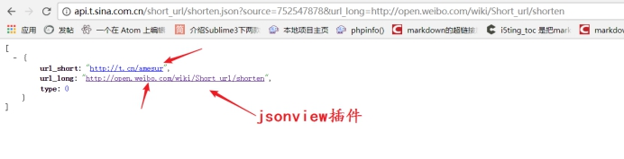
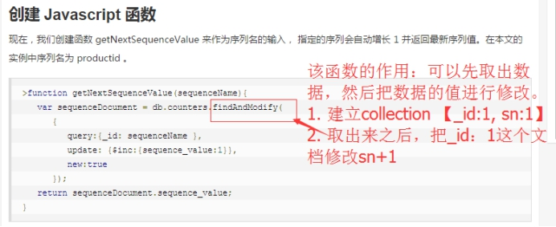
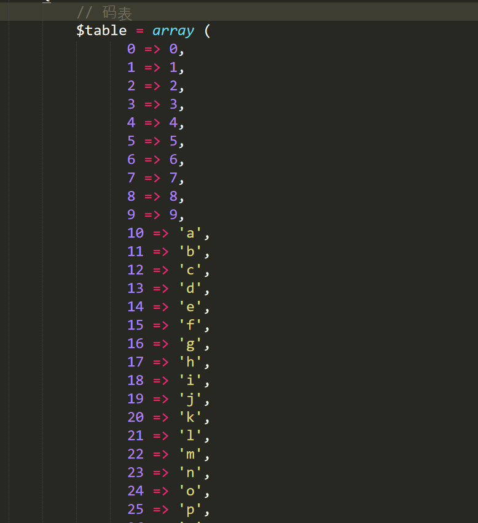
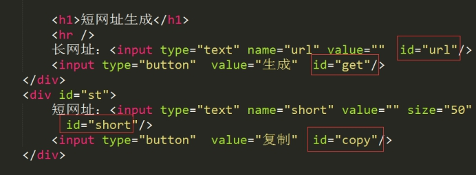
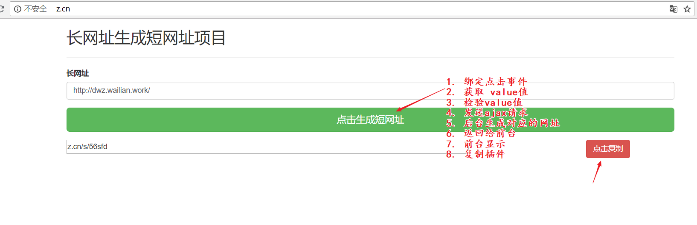
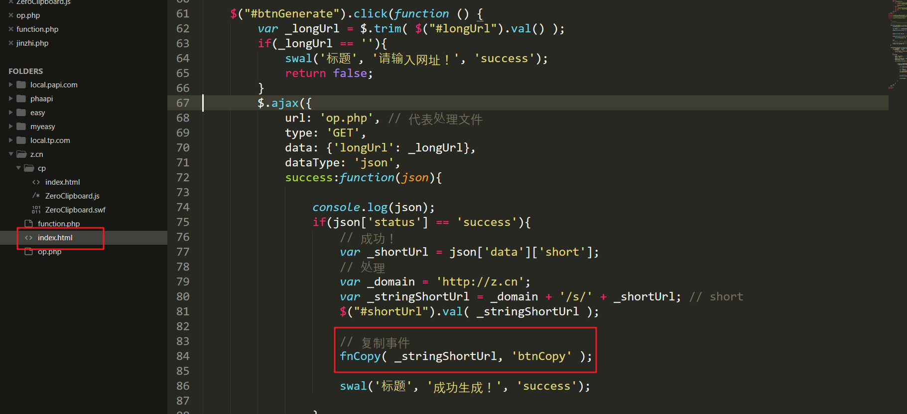
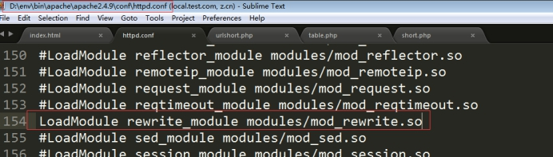
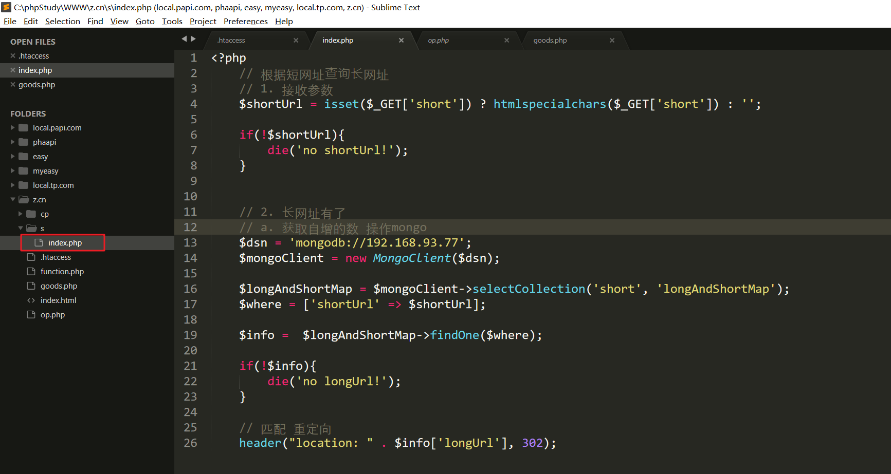

# mongoDB

# 案例：Mongodb实现短网址

## **简介**

将一个非常长的URL地址转换为一个比较短的URL地址。主要为了用户的一个体验，因为短的信息美观一些。同时也可以达到隐藏url地址信息，有的时候我们可以不希望用户直接看到url里面包含的信息，或者有的时候出于某些操作可能根不希望别人看到。

 

一般在微博里面最常见。有的时候手机的短信也可以收到类似的url地址。

 

体验地址：

<http://dwz.wailian.work/>

 

效果：

 

 

 

实现技术点：

1. 用户先输入一个长的网址，然后发送ajax请求去后台生成短的网址
2. 到时候后台会保存一个 短网址 和 长网址 的对应关系 【使用mongodb进行映射关系数据的存储】
3. 当用户利用短网址去访问的时候，短网址的服务器先判断短网址是否在本地的数据库里面存在，如果存在则取出后使用php的header(‘location:长URL’, 302)函数做一个跳转即可完成。【302：临时重定向】

 

## 新浪微博短网址api使用

现在如果实际是自己的公司要做这样的分享网址的业务，那么我们自己该如何处理呢？

答：

1. 自己是否存在短的域名
2. 使用第三方的API进行生成【短网址最先从新浪的微博演变过来的，因为微博在设计的时候，只能发送140个文字】

 


微信开发平台现在也支持短网址的操作。 

api文档：<http://open.weibo.com/wiki/Short_url/shorten>

 一款开源的PHP程序，让你可以轻松建立属于自己的短网址生成系统 【https://c7sky.com/yourls.html】


已知新浪有提供类似的API。

1. 成为新浪的开发者【身份证信息】
2. 创建应用（获取到appkey）

 

appkey： **752547878**

 

3. 根据文档进行接口调用，提供了两种方式的url请求

 

a) xml格式数据

http://api.t.sina.com.cn/short_url/shorten.xml?source=752547878&url_long=http://open.weibo.com/wiki/Short_url/shorten

b) json格式的数据

http://api.t.sina.com.cn/short_url/shorten.json?source=752547878&url_long=http://open.weibo.com/wiki/Short_url/shorten

 

 


## **用户自定义开发思路分析**

 

通过上面的操作，我们可以使用别人提供的API进行短网址的生成，但是我们现在处于学习，我们可以自己去实现一个短网址的转换项目。自己在本地定义一个域名(hosts文件里面定义即可 例如：b.cn)


思路：

1. 短网址必须唯一，一 一对应。可以参考MySQL的主键ID，即可以自增，也可以唯一
2. 网址必须短，但是需要存储的信息多。这个时候可以使用进制实现，进制可以实现使用较少的位数来保存更多的信息。
3. 短网址尽量乱，无规律。防止发现规律后批量请求。


统一现在规定短网址的位数在6位，查看一下不同进制下可以保存的所有的短网址的信息：

	二进制 111111    2^6
	八进制 777777   8^6
	十六进制 FFFFFF F   16^6
	六十二进制 62^6  

 

使用6位的62进制最多可以表示出500多亿种状态。


 

**使用62进制在处理的时候，不能体现出规律性**。则我们需要设计出一个自己的码表。之前我们使用的16进制，可以使用 0-9 A-F 来表示10进制的 0-15 这个16个数，则现在我们的62进制，则也需要使用62个字符来表示我们10进制的0-61。

**去哪里找出62个字符进行替代？**

0-9：十个阿拉伯数字

a-z：26个字符

A-Z：26个字符

----

正好为 62 个字符，所以我们可以使用上面的 字符行为一个码表。

| 序号 | 62进制 | 10进制 |
| ---- | ------ | ------ |
| 1    | 0      | 0      |
| 2    | 1      | 1      |
| 3    | 2      | 2      |
| 4    | 3      | 3      |
| 6    | 5      | 5      |
| 7    | 6      | 6      |
| 8    | 7      | 7      |
| 9    | 8      | 8      |
| 10   | 9      | 9      |
| 11   | a      | 10     |
| 12   | b      | 11     |
| 13   | c      | 12     |
| ...  | ....   | ...    |
| 60   | Y      | 60     |
| 61   | Z      | 61     |

62进制：ZY

10进制为：61*62^1 + 60 * 62^0


**问题：为什么要使用62进制来设计短网址了吗？**

答：进制大，短表示更多的可能性。

 

## **主键id和进制代码实现**

==代码实现的思路：==

* **首先 生成一个唯一的数字，然后把这个唯一的数字转换为62进制。**

   mongodb里面提供一个**全局计算器**，可以帮我们生成唯一的整数，理解成mysql里面的自增型的主键id。用户输入的一个长的url地址应该对应一个唯一的短的url地址。

   实现：

   <http://www.runoob.com/mongodb/mongodb-autoincrement-sequence.html>

 

演示：

1. 创建一个集合，集合里面存在两个字段

```
> use short

> db.counter.findAndModify({query:{'_id': 1} , update:{'$inc': {'value': 1}}});

{ "_id" : 1, "value" : 10 }
```

实现每调用一次，先获取对应的自增id 然后把对应的值自增一下。然后将自增的id转化为对应的短网址。

 

2. 变短的62进制和域名的前缀进行拼接

  定义码表 



转换函数


## **代码实现**

### **前台效果**

1. 创建一个 输入长网址转换为短网址的页面

 

效果



 

2. 完成页面的ajax提交事件


3. 复制按钮

   a) 复制静态资源到z.cn目录


​	b) 在index.html页面修改短网址框的val值 和 点击复制按钮的ID，并引入插件包


引入插件并定义复制函数


 

在完成ajax请求后进行复制函数调用




### **后台处理**

1. 在function.php定义好进制转换函数

 

在后台op.php生成短网址和长网址的映射关系


2. 如果存在则直接返回


 

3. 不存在则生成


### 短网址访问

1. 定义伪静态规则，开启Apache的rewrite模块

 

 

2. 开启虚拟主机的重写

 

 

3. 在网站根目录创建.htaccess文件

 

 

内容如下：


5. 在b.cn/s目录创建一个index.php完成跳转



 


 